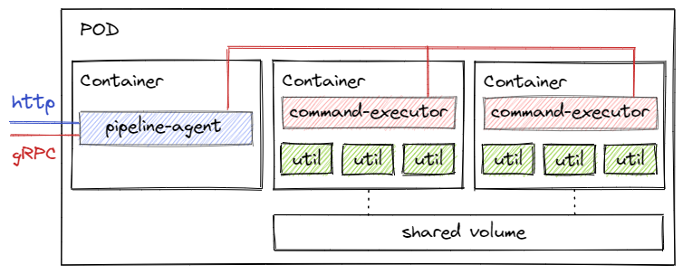

# Pipeline Agent
Sidecar container, responsible for executing commands in other containers in the pod.



An example of a pipeline that performs text recognition in the specified images:
```yaml
{
  "commands": [
    {
      "executorName": "download",
      "commandLines": [
        "wget -O /mnt/pipe/pic1.png https://www.some-resource.com/pic1.png",
        "wget -O /mnt/pipe/pic2.jpg https://www.some-resource.com/pic2.jpg",
        "wget -O /mnt/pipe/pic3.gif https://www.some-resource.com/pic3.jpg"
      ]
    },
    {
      "executorName": "ocr",
      "commandLines": [
        "for file in $(ls -v *.*) ; do tesseract $file {file%.*}.txt; done"
      ]
    },
    {
      "executorName": "save",
      "commandLines": [
        "mc mb buckets/5840e11b-2117-4036-a6e6-bcff03fbd3c9",
        "mc cp --recursive /mnt/pipe/ buckets/5840e11b-2117-4036-a6e6-bcff03fbd3c9",
        "rm -r /mnt/pipe/*"
      ]
    }
  ]
}
```
